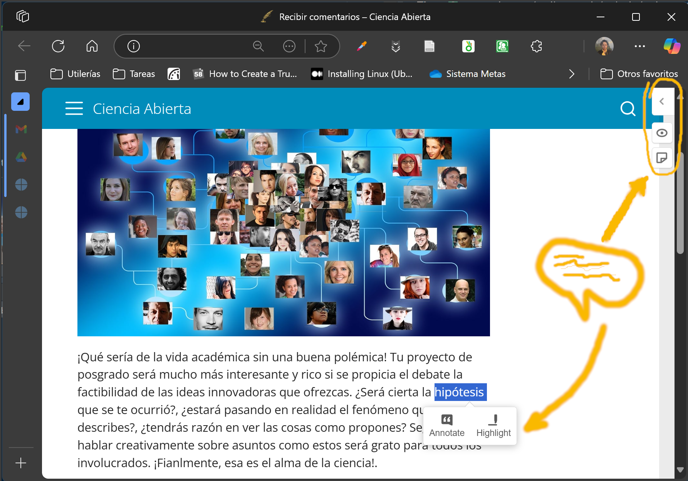
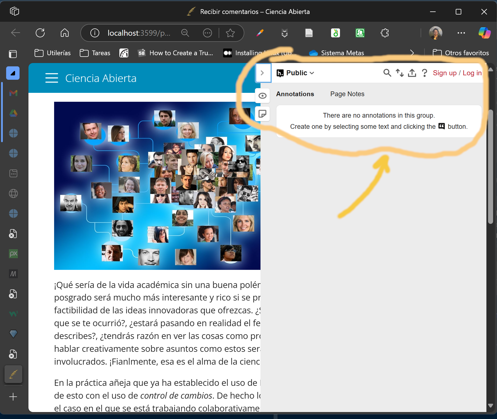

{width=50% fig-align="center"}

¡Qué sería de la vida académica sin una buena polémica! Tu proyecto de posgrado será mucho más interesante y rico si se propicia el debate la factibilidad de las ideas innovadoras que ofrezcas. ¿Será cierta la hipótesis que se te ocurrió?, ¿estará pasando en realidad el fenómeno que describes?, ¿tendrás razón en ver las cosas como propones? Seguramente hablar creativamente sobre asuntos como estos será grato para todos los involucrados. ¡Finalmente, esa es el alma de la ciencia!.

En la práctica añeja que ya ha establecido el uso de _MS Word_, se hace algo de esto con el uso de *control de cambios*. De hecho lo hace muy bien para el caso en el que se está trabajando colaborativamente sobre un texto. Incluye la posibilidad de incluir *comentarios*, que también resulta muy útil. ¿Podremos hacer algo semejante en el enfoque basado en *Quarto* que hemos venido desarrollando?

Dejaré que tu respondas esa pregunta. Desde mi punto de vista, el tema de control de cambios no es otra cosa que una variante adecuadamente acota de _control de versiones_, es decir **Git** en el mundo *Rstudio-Quarto*. Quizás te parezca bastante distinto, pues ciertamente **Git** es mucho más amplio y quizás esa potencialidad ampliada, acompañada de une _curva de aprendizaje_, te genere algo de dudas. Pero, espero que con lo que hemos venido aprendiendo puedas apreciar la semejanza y, eventualmente, las virtudes de **Git**.

Ahora, ¿qué hay en cuanto a comentarios al texto? Hay algunas opciones que espero encuentres interesantes. Dos de ellas están asociadas al sistema de comentarios o *issues* de *Github* (`utterances` e `giscus`). Con ellas se habilita una sección que recibe comentarios de los visitantes a tu **blog**. El tercero es `hypothesis` usa un sistema basado en el servicio web [hypothes.is](http://hypothes.is), que es el que yo encuentro más práctico. Te permite recibir retroalimentación directamente sobre tu texto. Ya sea alguna indicación sobre una palabra o toda una reflexión sobre un idea. El concepto se basa en marcar el texto de interés y vincular esa marca con el comentario que desee compartir el lector contigo. Te sugiero que lo pongamos a prueba.

Para activarlo hay agregar `comments: `en el encabezado **YAML** del documento que quieras abrir a la recepción de comentarios, con las indicaciones de tu preferencia. Quedaría algo así para usar `hypothes.is`:

:::{style="font-weight: bold; background-color: WhiteSmoke;"}
``` yaml
---
⋮
comments: 
  hypothesis: true 
⋮
---
```
:::

EL resultado será que el documento ofrecerá al lector la posibilidad de anotar el texto de varias maneras, como se puede apreciar en la figura siguiente.

\ 



## Comentarios privados vs públicos

La pequeña flecha arriba a la derecha abre el espacio de registro de los comentarios. Puedes notar que inicialmente los comentarios se registran en un _ámbito_ **público**. Con objeto de que tengas algo más de control sobre el público con el que te interesa interactuar te sugiero usar grupos específicos que requieren invitación. Así que el camino te llevará a registrarte en `hypothes.is` y desde tu cuenta podrás generar los grupos y las invitaciones.



## Mantener los comentarios entre versiones

El vínculo entre tu documento ya publicado y el *servicio hypothes.is* se realiza a través de una liga que identifica a tu blog en forma única en el **Ciberespacio**. Este **link** obviamente varía cada vez que haces un *Render*, pues en realidad produces un nuevo documento cada vez. Para que eso no sea un obstáculo hay que definir una **liga permanente** (*persistent canonical URL*). A continuación te explico como hacerlo.

Lo primero es crear un pequeño script que haga la tarea de revisar tu blog y tomar nota del contenido y en donde se necesitan ligas permanentes.
Este es el script que hace esa tarea. Créalo como documento de texto simple aquí mismo en **RStudio** y guárdalo con el nombre `_canonical.html` en la raíz de tu proyecto:

```js
<script>
  (function() {
    var link = document.createElement('link');
    link.rel = 'canonical';
    // Replace with your real Netlify production domain
    link.href = 'https://yourdomain.com' + window.location.pathname;
    document.head.appendChild(link);
  })();
</script>
```

Luego, en tu archivo `_quarto.yml` agrega la línea `include-in-header: _canonical.html` siguiendo esta idea:


```yaml

project:
  type: website

website:
  title: "My Team Project"

format:
  html:
    include-in-header: _canonical.html
    comments:
      hypothesis: true 

```